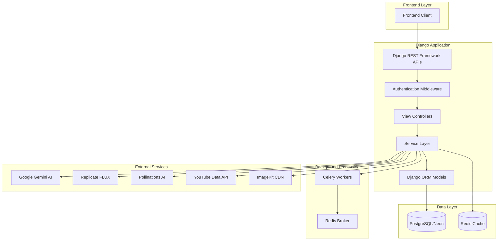

# Design Document: InsightStream Django

## Overview

InsightStream is a YouTube analytics and content creation platform being rebuilt with Django. The platform provides AI-powered tools including thumbnail generation, content optimization, keyword research, trending hashtags, outlier detection, and upload streak analysis. This design document outlines the architecture, components, and implementation approach for the Django-based system.

The Django implementation will leverage:
- Django REST Framework for API endpoints
- Django's built-in authentication system
- PostgreSQL (Neon) for data persistence
- Celery for background task processing
- External AI services (Gemini, Replicate, Pollinations)
- YouTube Data API v3 for video data

## Architecture



### High-Level Architecture

1. **API Layer**: Django REST Framework handles all HTTP requests with serializers for validation
2. **Service Layer**: Business logic encapsulated in service classes for each feature
3. **Data Layer**: Django ORM models with PostgreSQL backend
4. **Background Processing**: Celery for long-running AI generation tasks
5. **External Integrations**: Dedicated client classes for each external API

## Components and Interfaces

### 1. Django Project Structure

```
insightstream/
├── manage.py
├── requirements.txt
├── insightstream/
│   ├── __init__.py
│   ├── settings.py
│   ├── urls.py
│   ├── wsgi.py
│   └── celery.py
├── apps/
│   ├── users/
│   │   ├── models.py
│   │   ├── views.py
│   │   ├── serializers.py
│   │   ├── urls.py
│   │   └── services.py
│   ├── thumbnails/
│   │   ├── models.py
│   │   ├── views.py
│   │   ├── serializers.py
│   │   ├── urls.py
│   │   ├── services.py
│   │   └── tasks.py
│   ├── content/
│   │   ├── models.py
│   │   ├── views.py
│   │   ├── serializers.py
│   │   ├── urls.py
│   │   └── services.py
│   ├── keywords/
│   │   ├── views.py
│   │   ├── serializers.py
│   │   ├── urls.py
│   │   └── services.py
│   ├── hashtags/
│   │   ├── views.py
│   │   ├── serializers.py
│   │   ├── urls.py
│   │   └── services.py
│   ├── analytics/
│   │   ├── views.py
│   │   ├── serializers.py
│   │   ├── urls.py
│   │   └── services.py
│   └── admin_dashboard/
│       ├── views.py
│       ├── serializers.py
│       ├── urls.py
│       └── services.py
├── core/
│   ├── __init__.py
│   ├── clients/
│   │   ├── gemini.py
│   │   ├── replicate.py
│   │   ├── pollinations.py
│   │   ├── youtube.py
│   │   └── imagekit.py
│   ├── utils/
│   │   ├── api_key_manager.py
│   │   ├── retry.py
│   │   └── validators.py
│   └── exceptions.py
└── tests/
    ├── conftest.py
    ├── test_users/
    ├── test_thumbnails/
    ├── test_content/
    ├── test_keywords/
    ├── test_hashtags/
    ├── test_analytics/
    └── test_admin/
```

### 2. Core Interfaces

#### API Key Manager Interface
```python
class APIKeyManager:
    def get_active_key(self, service: str) -> str:
        """Get the current active API key for a service."""
        
    def rotate_key(self, service: str) -> str:
        """Rotate to the next available API key."""
        
    def mark_rate_limited(self, service: str, key: str) -> None:
        """Mark a key as rate limited."""
        
    def is_exhausted(self, service: str) -> bool:
        """Check if all keys for a service are exhausted."""
```

#### AI Service Interface
```python
class AIServiceInterface(ABC):
    @abstractmethod
    def generate(self, prompt: str, **kwargs) -> dict:
        """Generate content based on prompt."""
        
    @abstractmethod
    def is_available(self) -> bool:
        """Check if the service is available."""
```

#### YouTube Client Interface
```python
class YouTubeClient:
    def search_videos(self, query: str, max_results: int = 10) -> list[dict]:
        """Search for videos by query."""
        
    def get_video_statistics(self, video_ids: list[str]) -> dict:
        """Get statistics for multiple videos."""
        
    def get_channel_videos(self, channel_id: str, max_results: int = 50) -> list[dict]:
        """Get videos from a channel."""
        
    def get_trending_videos(self, category: str = None) -> list[dict]:
        """Get trending videos."""
```

### 3. Service Layer Components

#### ThumbnailService
```python
class ThumbnailService:
    def generate_thumbnail(self, prompt: str, ref_image: str = None, user_email: str) -> dict:
        """Generate thumbnail using AI with fallback."""
        
    def get_user_thumbnails(self, user_email: str) -> list[dict]:
        """Get all thumbnails for a user."""
        
    def upload_to_cdn(self, image_data: bytes) -> str:
        """Upload image to ImageKit CDN."""
```

#### ContentService
```python
class ContentService:
    def generate_content(self, topic: str, user_email: str) -> dict:
        """Generate 3 video concepts with SEO optimization."""
        
    def calculate_seo_score(self, title: str, keywords: list[str]) -> int:
        """Calculate SEO score for a title."""
        
    def get_user_content(self, user_email: str) -> list[dict]:
        """Get all generated content for a user."""
```

#### AnalyticsService
```python
class AnalyticsService:
    def detect_outliers(self, channel_id: str) -> dict:
        """Detect outlier videos using IQR method."""
        
    def calculate_smart_score(self, video: dict) -> float:
        """Calculate SmartScore for a video."""
        
    def analyze_upload_streak(self, channel_id: str) -> dict:
        """Analyze upload consistency and algorithm score."""
        
    def calculate_algorithm_score(self, videos: list[dict]) -> int:
        """Calculate YouTube algorithm score (0-100)."""
```

## Data Models

### User Model
```python
class User(AbstractUser):
    email = models.EmailField(unique=True)
    created_at = models.DateTimeField(auto_now_add=True)
    
    USERNAME_FIELD = 'email'
    REQUIRED_FIELDS = ['username']
```

### Thumbnail Model
```python
class Thumbnail(models.Model):
    user = models.ForeignKey(User, on_delete=models.CASCADE, related_name='thumbnails')
    user_input = models.CharField(max_length=500)
    thumbnail_url = models.URLField(max_length=1000)
    ref_image = models.URLField(max_length=500, null=True, blank=True)
    created_at = models.DateTimeField(auto_now_add=True)
    
    class Meta:
        ordering = ['-created_at']
```

### AIContent Model
```python
class AIContent(models.Model):
    user = models.ForeignKey(User, on_delete=models.CASCADE, related_name='ai_contents')
    user_input = models.CharField(max_length=500)
    content = models.JSONField()
    thumbnail_url = models.URLField(max_length=500, null=True, blank=True)
    created_at = models.DateTimeField(auto_now_add=True)
    
    class Meta:
        ordering = ['-created_at']
```

### Content JSON Structure
```python
{
    "concepts": [
        {
            "title": str,
            "seo_score": int,  # 0-100
            "description": {
                "hook": str,
                "main_content": str,
                "cta": str
            },
            "tags": list[str]
        }
    ]
}
```

## Correctness Properties

*A property is a characteristic or behavior that should hold true across all valid executions of a system-essentially, a formal statement about what the system should do. Properties serve as the bridge between human-readable specifications and machine-verifiable correctness guarantees.*

### Property 1: User Registration Creates Valid User
*For any* valid registration data (unique email, strong password), registering a user should result in a user record in the database with the same email, and subsequent login with those credentials should succeed.
**Validates: Requirements 1.1, 1.2**

### Property 2: Protected Route Access Control
*For any* protected API endpoint and any request without valid authentication, the system should return a 401 Unauthorized response.
**Validates: Requirements 1.3, 12.5**

### Property 3: Session Invalidation on Logout
*For any* authenticated user session, after logout the session token should no longer grant access to protected endpoints.
**Validates: Requirements 1.4**

### Property 4: Email Uniqueness Validation
*For any* email address already registered in the system, attempting to register with the same email should fail with a validation error.
**Validates: Requirements 1.5**

### Property 5: Thumbnail Generation Fallback
*For any* thumbnail generation request, if the primary provider (Replicate) fails, the system should successfully complete the request using the fallback provider (Pollinations).
**Validates: Requirements 2.2**

### Property 6: Thumbnail Data Persistence Round-Trip
*For any* successfully generated thumbnail, querying the user's thumbnail history should return a record containing the original prompt, the generated URL, and a valid timestamp.
**Validates: Requirements 2.3, 2.5, 11.1**

### Property 7: Content Generation Structure
*For any* content generation request with a valid topic, the response should contain exactly 3 concepts, each with a title, SEO score (0-100), description with hook/main/cta sections, and a non-empty tags list.
**Validates: Requirements 3.1, 3.2, 3.3**

### Property 8: Content Generation Fallback
*For any* content generation request where the AI service fails, the system should return a valid fallback response with the same structure (3 concepts with required fields).
**Validates: Requirements 3.4**

### Property 9: Content Data Persistence Round-Trip
*For any* successfully generated content, querying the user's content history should return a record with valid JSON content matching the original generation.
**Validates: Requirements 3.5, 11.2**

### Property 10: Keyword Research Response Completeness
*For any* keyword research request with a valid topic, the response should contain primary keywords, long-tail keywords, trending keywords, and related topics, each with search volume, competition, and relevance metadata.
**Validates: Requirements 4.1, 4.2, 4.3, 4.4, 4.5**

### Property 11: Hashtag Extraction Pattern Matching
*For any* string containing hashtags (pattern: #[a-zA-Z0-9_]+), the hashtag extraction function should return all hashtags present in the string.
**Validates: Requirements 5.2**

### Property 12: Hashtag Response Completeness
*For any* hashtag generation request, the response should contain both extracted real hashtags and AI-generated hashtags, each with usage count and engagement metrics.
**Validates: Requirements 5.1, 5.3, 5.4**

### Property 13: Video Search Results Completeness
*For any* video search query returning results, each result should contain video statistics (views, likes, comments, publish date) and a thumbnail URL.
**Validates: Requirements 6.1, 6.2**

### Property 14: Thumbnail Tag Generation
*For any* thumbnail image submitted for analysis, the system should return a non-empty list of AI-generated descriptive tags.
**Validates: Requirements 6.5**

### Property 15: SmartScore Calculation Correctness
*For any* video with views, velocity (views/day), and engagement rate, the SmartScore should equal (0.5 × normalized_views) + (0.3 × normalized_velocity) + (0.2 × normalized_engagement).
**Validates: Requirements 7.2**

### Property 16: Metric Normalization Range
*For any* set of video metrics being normalized, all normalized values should be within the range [0, 1].
**Validates: Requirements 7.3**

### Property 17: IQR Outlier Detection Correctness
*For any* dataset of SmartScores, high outliers should be values > Q3 + 1.5×IQR and low outliers should be values < Q1 - 1.5×IQR, where IQR = Q3 - Q1.
**Validates: Requirements 7.1, 7.4**

### Property 18: Views Per Day Calculation
*For any* video with a view count and publish date, the views per day should equal total_views / days_since_publish (minimum 1 day).
**Validates: Requirements 7.5**

### Property 19: Algorithm Score Range
*For any* upload streak analysis, the algorithm score should be an integer in the range [0, 100].
**Validates: Requirements 8.1**

### Property 20: Shorts Detection
*For any* video, the Shorts detection should correctly identify videos with duration ≤ 60 seconds or vertical aspect ratio as Shorts.
**Validates: Requirements 8.3**

### Property 21: Admin Authentication
*For any* admin login attempt with correct credentials (matching environment variables), access should be granted; for incorrect credentials, access should be denied with an error.
**Validates: Requirements 9.1, 9.5**

### Property 22: Admin Stats Completeness
*For any* admin stats request, the response should include total users count, total thumbnails count, total content count, most active users list, and recent registrations list.
**Validates: Requirements 9.2, 9.3, 9.4**

### Property 23: API Key Rotation
*For any* API service with multiple keys, when the current key is rate-limited, the system should rotate to the next available key and continue operation.
**Validates: Requirements 10.1**

### Property 24: API Key Exhaustion Handling
*For any* API service where all keys are rate-limited, the system should return a user-friendly error message indicating temporary unavailability.
**Validates: Requirements 10.2**

### Property 25: History Ordering
*For any* user's thumbnail or content history request, items should be returned in descending order by creation date (newest first).
**Validates: Requirements 11.3**

### Property 26: User Association
*For any* stored thumbnail or content record, the record should be associated with the creating user's email address.
**Validates: Requirements 11.4**

### Property 27: API Response Format
*For any* API request, the response should be valid JSON with appropriate HTTP status codes (2xx for success, 4xx for client errors, 5xx for server errors).
**Validates: Requirements 12.1, 12.2**

### Property 28: Input Validation
*For any* API request with invalid input data, the system should return a 400 Bad Request with detailed validation error messages.
**Validates: Requirements 12.3**

### Property 29: Pagination Correctness
*For any* paginated list endpoint with page_size N and total items M, requesting page P should return min(N, M - (P-1)*N) items, and the response should include total count and pagination metadata.
**Validates: Requirements 12.4**

## Error Handling

### Error Response Format
```python
{
    "error": {
        "code": str,  # e.g., "VALIDATION_ERROR", "AI_SERVICE_UNAVAILABLE"
        "message": str,  # User-friendly message
        "details": dict  # Optional additional details
    }
}
```

### Error Categories

| Error Code | HTTP Status | Description |
|------------|-------------|-------------|
| VALIDATION_ERROR | 400 | Invalid input data |
| UNAUTHORIZED | 401 | Missing or invalid authentication |
| FORBIDDEN | 403 | Insufficient permissions |
| NOT_FOUND | 404 | Resource not found |
| RATE_LIMITED | 429 | API rate limit exceeded |
| AI_SERVICE_UNAVAILABLE | 503 | All AI providers unavailable |
| YOUTUBE_API_ERROR | 502 | YouTube API failure |
| INTERNAL_ERROR | 500 | Unexpected server error |

### Retry Strategy
- External API calls use exponential backoff: 1s, 2s, 4s (max 3 retries)
- Rate-limited requests trigger automatic key rotation
- Failed AI generation triggers fallback provider

## Testing Strategy

### Testing Framework
- **pytest**: Primary testing framework
- **pytest-django**: Django integration
- **hypothesis**: Property-based testing library
- **factory_boy**: Test data factories
- **responses**: HTTP mocking for external APIs

### Unit Tests
Unit tests verify specific examples and edge cases:
- Model validation and constraints
- Serializer validation logic
- Service method behavior with mocked dependencies
- Utility function correctness
- Error handling paths

### Property-Based Tests
Property tests verify universal properties across all inputs using Hypothesis:
- Each correctness property from this document will have a corresponding property test
- Tests will be annotated with: `**Feature: insightstream-django, Property {number}: {property_text}**`
- Minimum 100 iterations per property test
- Smart generators for domain-specific data (emails, video stats, etc.)

### Integration Tests
- API endpoint testing with Django test client
- Database transaction testing
- Authentication flow testing
- External service integration (with mocked responses)

### Test Organization
```
tests/
├── conftest.py              # Shared fixtures and factories
├── properties/              # Property-based tests
│   ├── test_auth_properties.py
│   ├── test_thumbnail_properties.py
│   ├── test_content_properties.py
│   ├── test_analytics_properties.py
│   └── test_api_properties.py
├── unit/                    # Unit tests
│   ├── test_models.py
│   ├── test_serializers.py
│   ├── test_services.py
│   └── test_utils.py
└── integration/             # Integration tests
    ├── test_api_endpoints.py
    └── test_external_services.py
```

### Test Data Generators (Hypothesis Strategies)
```python
# Custom strategies for domain data
valid_emails = emails()
video_stats = fixed_dictionaries({
    'views': integers(min_value=0, max_value=10**9),
    'likes': integers(min_value=0, max_value=10**7),
    'comments': integers(min_value=0, max_value=10**6),
    'publish_date': datetimes(min_value=datetime(2005, 1, 1))
})
smart_scores = floats(min_value=0, max_value=1)
```
